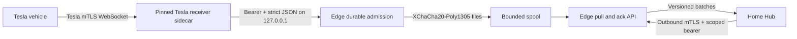

# Edge architecture

Teslatlas Edge is a narrow, optional ingress between Tesla Fleet Telemetry and
a user's home Hub. The public host receives vehicle telemetry; the home Hub
initiates the delivery connection.

## Data path

The pinned Tesla Fleet Telemetry v0.9.4 sidecar owns Tesla's WebSocket,
protobuf, vehicle certificate, and reliable-ack protocol. Its Teslatlas patch
posts a decoded envelope only to
`http://127.0.0.1:8080/v1/internal/fleet-telemetry`. It acknowledges a vehicle
record only after Edge returns an HTTP 2xx response.

Edge acknowledges that loopback request only after an encrypted file has been
written, synced, and atomically renamed into the pending spool. A home Hub then
pulls a deterministic batch, commits each new `record_id`, and posts an exact
acknowledgement. Edge deletes only accepted records from the current batch.

## Trust boundaries

| Boundary | Authentication | Data allowed |
| --- | --- | --- |
| Vehicle to sidecar | Tesla vehicle mTLS | Fleet Telemetry only |
| Sidecar to Edge | Loopback plus private bearer | Strict envelope, 256 KiB maximum |
| Hub to Edge | Trusted Hub client certificate plus rotating bearer | Batch pull and acknowledgement only |
| Edge disk | Mode-0600 key plus XChaCha20-Poly1305 | Retention-limited pending envelopes |

The public Hub listener never serves plaintext HTTP. The loopback listener
contains receiver admission, liveness, readiness, and privacy-safe aggregate
metrics. It must not be exposed by a reverse proxy or firewall rule.

## Reliability model

- Receiver duplicate admission is idempotent by deterministic `record_id`.
- Pending records survive process and host restart when the spool and key
  survive.
- Disconnect before acknowledgement returns the same oldest-first batch.
- Hub persists its unique `record_id` decision before it acknowledges.
- Edge deletes accepted records only after a valid acknowledgement for the
  current batch.
- Capacity or storage-full admission fails with 507; Edge never evicts an
  unexpired pending record to make space.
- Retention expiry and corrupt ciphertext are counted and make readiness
  degraded. They are never silent success paths.
- Shutdown asks both listeners to drain for at most five seconds, aborts any
  remaining task, then syncs spool directories.

## Privacy boundary

Spool file names contain admission time and a content digest, never VIN or
payload text. Metrics and health expose only numeric queue, corruption, expiry,
and fixed-reason counters. Logs and errors must not include VIN, transaction
ID, bearer, certificate material, coordinates, or raw payload.

## Explicit exclusions

Edge has no Tesla access token, refresh token, OAuth client secret, command
key, vehicle-command endpoint, consumer API, drive/charge projection, or
mandatory central relay. Tesla account administration happens separately and
its credentials are never copied to Edge.
